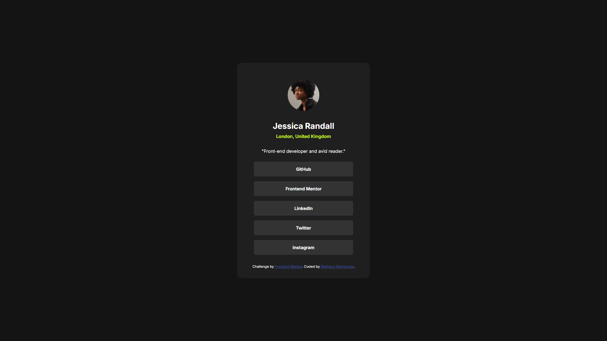
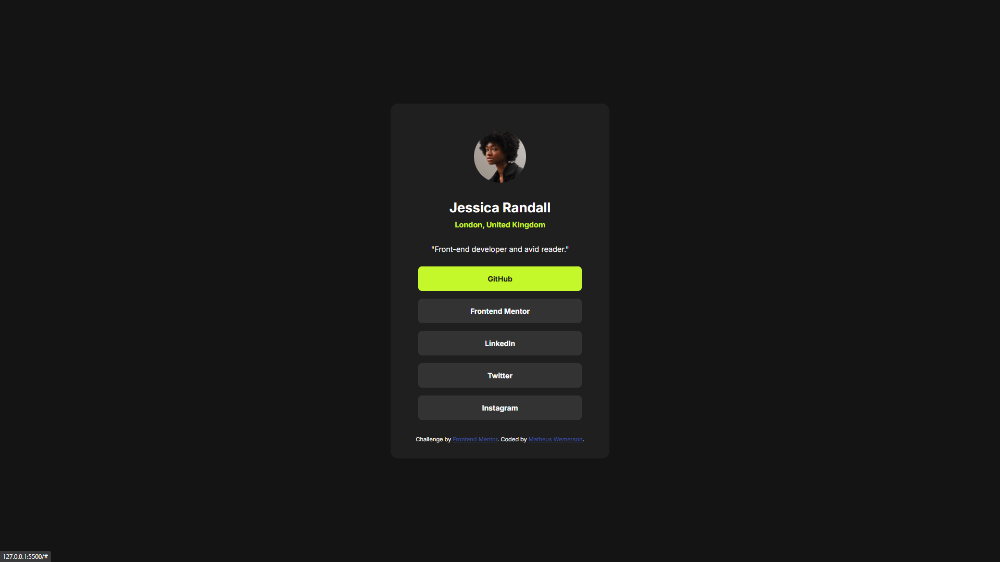
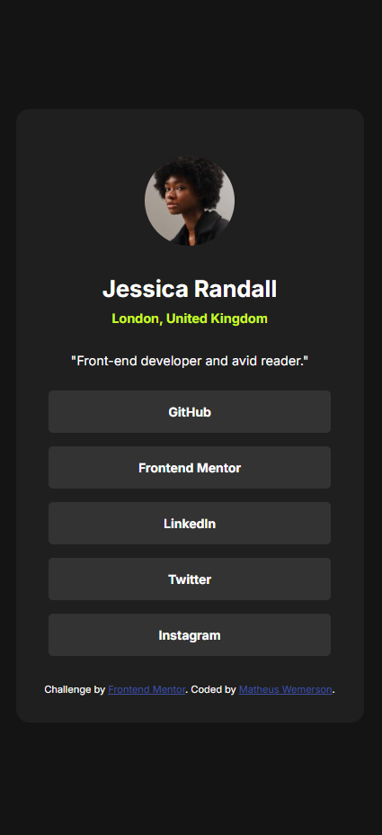

# Frontend Mentor - Social links profile solution

This is a solution to the [Social links profile challenge on Frontend Mentor](https://www.frontendmentor.io/challenges/social-links-profile-UG32l9m6dQ). Frontend Mentor challenges help you improve your coding skills by building realistic projects. 

## Table of contents

- [Overview](#overview)
  - [The challenge](#the-challenge)
  - [Screenshots](#screenshots)
  - [Links](#links)
- [My process](#my-process)
  - [Built with](#built-with)
  - [What I learned](#what-i-learned)
  - [Continued development](#continued-development)
  - [Useful resources](#useful-resources)
- [Author](#author)
- [Acknowledgments](#acknowledgments)

## Overview

### The challenge

Users should be able to:

- See hover and focus states for all interactive elements on the page

### Screenshots





### Links

- Solution URL: (https://www.frontendmentor.io/solutions/social-links-page-using-css-flexbox-HEUoE3BVYO)
- Live Site URL: (https://matheuswemerson.github.io/social-links/)

## My process

### Built with

- Semantic HTML5 markup
- CSS custom properties
- Flexbox
- Mobile-first workflow
- Responsive design
- [GitHub Pages](https://pages.github.com/) - For deployment

### What I learned

This was my first challenge from Frontend Mentor, and I learned a lot throughout the process. I started by building the main structure in HTML, and when I finished, I felt very proud of the result. It was my first time doing something like this, and it made me really happy!

```html
  <main>
    <header>
      <div class="card">
       <div class="card_avatar"></div>
       <div class="card_info">
          <div class="card_info_name"><h1>Jessica Randall</h1></div>
          <div class="card_info_local"><h2>London, United Kingdom</h2></div>
          <div class="card_info_desc"><p>"Front-end developer and avid reader."</p></div>
        </div>
      </header>
      <nav>
      <div class="card_links">
         <ul>
            <li class="github"><a href="#">GitHub</a></li>
            <li class="frontend-mentor"><a href="#">Frontend Mentor</a></li>
            <li class="linkedin"><a href="#">LinkedIn</a></li>
            <li class="twitter"><a href="#">Twitter</a></li>
            <li class="instagram"><a href="#">Instagram</a></li>
         </ul>
      </div>
      </nav>
      <footer>
        <div class="attribution">
          Challenge by <a href="https://www.frontendmentor.io?ref=challenge" target="_blank">Frontend Mentor</a>. 
          Coded by <a href="https://www.frontendmentor.io/profile/matheuswemerson" target="_blank">Matheus Wemerson</a>.
        </div>
        </footer>
    </div>
  </main>
```
One of the things I'm most proud of is how I used Flexbox to structure the layout of the main container. I also applied CSS custom properties (variables) to make the design consistent and easy to maintain. Here's an example of the CSS I wrote for the main container:
```css
main {
    display: flex;
    flex-direction: column;
    align-items: center;
    justify-content: center;
    width: 90%; 
    max-width: 420px; 
    background: var(--grey-800);
    border-radius: 15px;
    padding: 20px;
    gap: 20px;
}
```

### Continued development

I hope to enhance my frontend skills by taking on more challenges like this one. I plan to work on additional projects to refine and perfect my CSS Flexbox layout design skills. While I still feel a bit uncertain and sometimes intimidated by certain challenges, my goal is to overcome them all and continue improving!

### Useful resources

- [Frontend Mentor - Solutions](https://www.frontendmentor.io/solutions) - It was helpful to explore other people's solutions to gain insights and find ways to improve my own approach.

## Author

- Frontend Mentor - [@matheuswemerson](https://www.frontendmentor.io/profile/matheuswemerson)
- Linkedin - [@yourusername](https://www.linkedin.com/in/matheuswemerson/)

## Acknowledgments

I got a lot of inspiration from many solutions in the Frontend Mentor community. I want to thank the entire community and everyone who continues to take on challenges. I hope we can grow together, and I also hope my solution helps someone as well.
